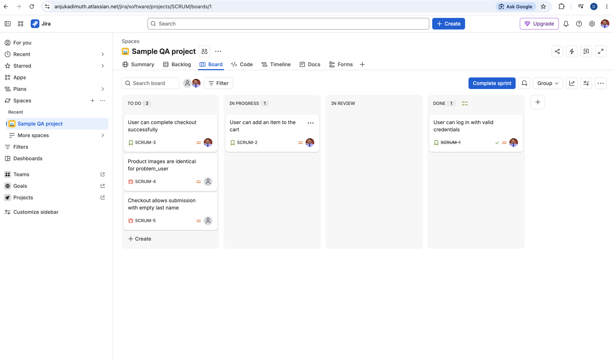
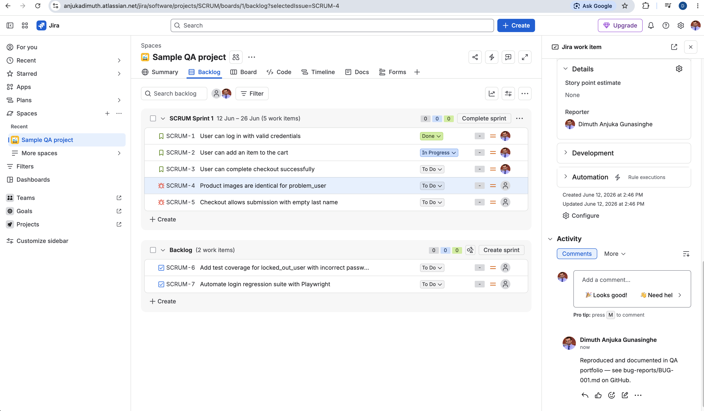

# Jira — Scrum Project (Sprint Planning, Backlog, Defect Tracking)

**Tool used:** Jira (Cloud, free tier) — project key `SCRUM`
**Application under test:** https://www.saucedemo.com/
**Author:** Dimuth Anjuka
**Date:** 26 Aug 2026

## Purpose

This project demonstrates Scrum-style work tracking applied to the same SauceDemo testing
work documented elsewhere in this portfolio (`test-cases/`, `bug-reports/`) — sprint
planning, active sprint execution, backlog grooming, and defect tracking, all in one place
rather than as isolated Jira screenshots.

## Sprint 1 (12 Jun – 26 Jun)

| Key | Summary | Type | Status |
|---|---|---|---|
| SCRUM-1 | User can log in with valid credentials | Story | **Done** — matches completed login testing in `test-cases/saucedemo-login-test-cases.md` |
| SCRUM-2 | User can add an item to the cart | Story | In Progress |
| SCRUM-3 | User can complete checkout successfully | Story | To Do |
| SCRUM-4 | Product images are identical for `problem_user` | Bug | To Do — linked via comment to `bug-reports/BUG-001.md` |
| SCRUM-5 | Checkout allows submission with empty last name | Bug | To Do |

## Defect tracking — linking Jira to the actual bug report

SCRUM-4 corresponds to a real, already-documented defect. Rather than duplicate the
detail in two places, the Jira ticket carries a comment pointing back to the source of
truth:

> Reproduced and documented in QA portfolio — see `bug-reports/BUG-001.md` on GitHub.

This is deliberate: Jira tracks the defect's status and sprint membership, while the
markdown bug report holds the full repro steps and evidence — the same separation a real
team would use between an issue tracker and a detailed report.

## Backlog — groomed from known gaps

Two items were added to the backlog (not pulled into the current sprint), each traceable
to a specific gap already identified elsewhere in this portfolio rather than invented for
this exercise:

| Key | Summary | Traceability |
|---|---|---|
| SCRUM-6 | Add test coverage for `locked_out_user` with incorrect password | Matches TC-LOGIN-06, an identified-but-unexecuted gap in `test-cases/saucedemo-login-test-cases.md` |
| SCRUM-7 | Automate login regression suite with Playwright | Previews the next portfolio item (automated UI test suite) |

## What this demonstrates

- **Sprint planning:** a scoped sprint with a defined date range and a mix of story and bug work items
- **Active sprint execution:** realistic status distribution (Done / In Progress / To Do) rather than everything sitting untouched
- **Backlog management:** items groomed into the backlog with clear rationale, not just placeholders
- **Defect tracking:** bugs represented as their own issue type, cross-linked to a detailed report elsewhere in the portfolio
