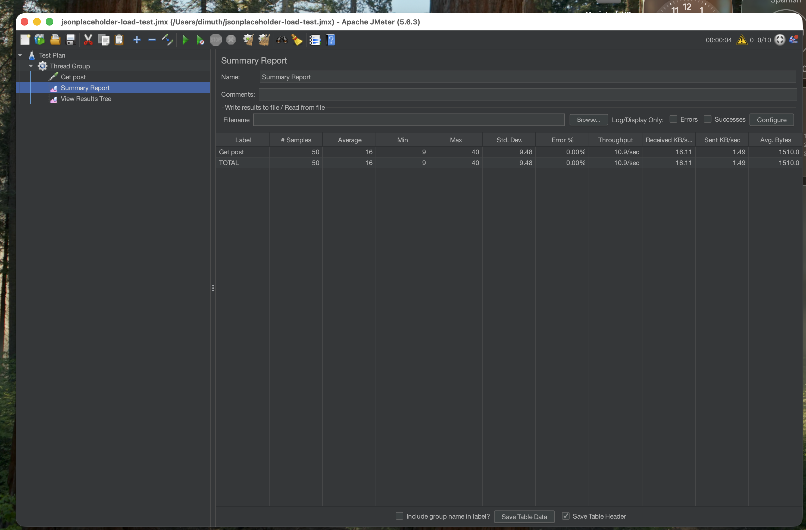

# JMeter — Performance Test

**Tool used:** Apache JMeter 5.6.3 (installed via Homebrew, GUI mode for test creation/debugging)
**Target:** `GET https://jsonplaceholder.typicode.com/posts/1` — the same endpoint functionally tested in `api-testing/`
**Author:** Dimuth Anjuka
**Date:** 26 Aug 2026

## Purpose

Functional correctness of this endpoint was already verified in Postman (`api-testing/jsonplaceholder-api-tests.postman_collection.json`
— status code 200, assertion passing). This test asks a different question: how does the
endpoint behave under concurrent load, not just a single request? That's the gap JMeter fills.

## Test plan configuration

| Setting | Value |
|---|---|
| Threads (virtual users) | 10 |
| Ramp-up period | 5 seconds |
| Loop count per thread | 5 |
| Total requests | 50 |
| Listeners | Summary Report, View Results Tree |

10 users ramping up over 5 seconds, each firing 5 requests, gives 50 total requests — enough
to produce a meaningful average/min/max spread without hammering a public API that other
people rely on for testing.

## Results

| Label | Samples | Average (ms) | Min (ms) | Max (ms) | Std. Dev. | Error % | Throughput |
|---|---|---|---|---|---|---|---|
| Get post | 50 | 16 | 9 | 40 | 9.48 | 0.00% | 10.9/sec |

## Interpretation

Zero errors across 50 concurrent-ish requests confirms the endpoint holds up under this load
level with no failures. The gap between average (16ms) and max (40ms) reflects normal
variance under concurrent load — some requests queue slightly behind others as threads ramp
up — rather than a performance problem. For a public demo API, these numbers aren't
something to optimize against; the value here is demonstrating the process: define a
realistic load profile, run it, and read the aggregate numbers (average, error rate,
throughput) rather than eyeballing a single request's response time.

## Files

- `jsonplaceholder-load-test.jmx` — the JMeter test plan, importable and re-runnable in any JMeter installation
